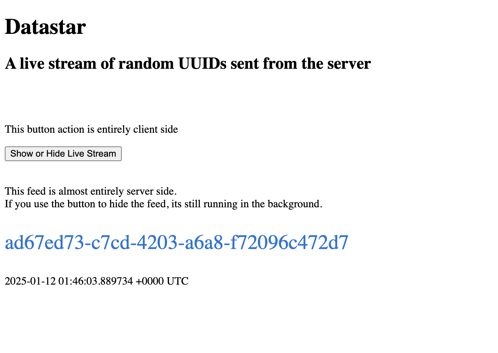

# Datastar & Golang

[Datastar](https://data-star.dev/) is a Hypermedia library similar to [HTMX](https://htmx.org/) that uses Server Sent Events (SSE). [(See MDN)](https://developer.mozilla.org/en-US/docs/Web/API/Server-sent_events/Using_server-sent_events)

Datastar can be used to provide client side interaction (which HTMX cannot do on its own) as well as server side interaction in a way that allows for an experience that has aspects of server side rendering as well as client side rendering.

Any backend technology can be used to power a Datastar site. This example uses Go (Golang) as the backend.

This repository contains a minimal example that can be cloned, installed and run. 

---
### Screenshot



- Yes its ugly, its minimal!

---
### Overview

- Clone the Repository
- Build and run the server with
```
    go run .
```
- Open your browser to http://localhost:3000
